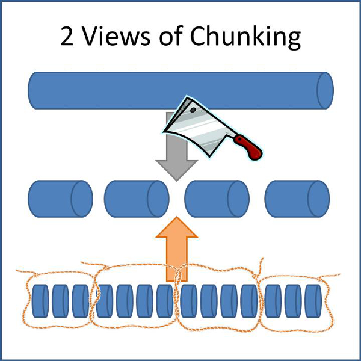

# Course Structure

<!-- vscode-markdown-toc -->
* 1. [WP Navigation Menu Architecture for Courses](#WPNavigationMenuArchitectureforCourses)
	* 1.1. [WP Navigation Menu Architecture](#WPNavigationMenuArchitecture)
	* 1.2. [Key Takeaways from WP Nav Menu](#KeyTakeawaysfromWPNavMenu)
	* 1.3. [Emulating WP Navigation Menu Architecture](#EmulatingWPNavigationMenuArchitecture)
	* 1.4. [Key Takeaways for Emulation](#KeyTakeawaysforEmulation)
	* 1.5. [Navigation Menu Theme Location for Whole Menu Reusability](#NavigationMenuThemeLocationforWholeMenuReusability)
	* 1.6. [Emulating Theme Locations for Course Reusability](#EmulatingThemeLocationsforCourseReusability)
* 2. [Extending Navigation Menu Architecture](#ExtendingNavigationMenuArchitecture)
	* 2.1. [Sections as Collections & Sections as Blocks](#SectionsasCollectionsSectionsasBlocks)
	* 2.2. [Course as a Section](#CourseasaSection)
	* 2.3. [Course & Sections as Taxonomy](#CourseSectionsasTaxonomy)
	* 2.4. [Quizzes & Assignments as Sections (Taxonomy Terms)](#QuizzesAssignmentsasSectionsTaxonomyTerms)
	* 2.5. [Objectives & Units as Post Types](#ObjectivesUnitsasPostTypes)
		* 2.5.1. [Unit as a Collection](#UnitasaCollection)
	* 2.6. [Sections and Course Heirarchy](#SectionsandCourseHeirarchy)
	* 2.7. [Course vs Section](#CoursevsSection)
	* 2.8. [References, not Actuals](#ReferencesnotActuals)
	* 2.9. [Reusability](#Reusability)
	* 2.10. [Export/ Import](#ExportImport)
* 3. [Actual Structure](#ActualStructure)

<!-- vscode-markdown-toc-config
	numbering=true
	autoSave=true
	/vscode-markdown-toc-config -->
<!-- /vscode-markdown-toc -->

##  1. <a name='WPNavigationMenuArchitectureforCourses'></a>WP Navigation Menu Architecture for Courses

Consider the fact that a course structure actually looks like menu (especially when presented as the syllabus or as an outline). With that in mind, its architecture could borrow a thing or two from the architecture of navigation menus.

###  1.1. <a name='WPNavigationMenuArchitecture'></a>WP Navigation Menu Architecture

* WordPress uses a taxonomy called `'nav_menu'`. See: https://developer.wordpress.org/reference/functions/wp_get_nav_menu_object/
* Every menu created is a term of the taxonomy `'nav_menu'`.
* Menu items within a menu are post objects of a heirarchical custom post type called `'nav_menu_item'`. See: https://developer.wordpress.org/reference/functions/wp_get_nav_menu_items/
* Each `'nav_menu_item'` has three metas, `'object_id'`, `'object'`, `'type'`
    1. `'object'` refers to the kind of object that is referred to. It can be a `'term'` or `'post'`
    1. `'type'` refers to the available object types, `'taxonomy'` or `'post_type'`
    1. `'object_id'` refers to the actual `'term_id'` or `'post_id'`
    * This is the general language used elsewhere in WP. In other contexts `'object'` can be `'comment'` and `'type'` could be `'comment_type'`.
    * There is scope for extending this to include custom objects (I have used widgets as menu items).
* When loading a menu, WordPress needs a slug to identify the term (the name of the menu) and then get all post types (menu items) associated with it. See: https://developer.wordpress.org/reference/functions/wp_nav_menu/
* Each menu item is a separate post object allowing it to become a extremely flexible reference for any kind of object.

###  1.2. <a name='KeyTakeawaysfromWPNavMenu'></a>Key Takeaways from WP Nav Menu

* A menu item is *not* the same as the link that it represents. That is, when you add a page (or any other post type) to a navigation menu, a new post is created in the database that refers to (serves as a **reference** to) the page you add.
* This separates the menu **structure** from the **content** that is displayed when you *open* the menu item.
* This means that the same page can be added to multiple menus. Hypothetically, if the menu item and the page were the same thing, everytime you'd add the page to a new menu, it'd have to be duplicated. (This is what happens in LifterLMS right now). It's obvious how this helps in **reusability**.
* A menu item can be a reference for an **external resource**.

###  1.3. <a name='EmulatingWPNavigationMenuArchitecture'></a>Emulating WP Navigation Menu Architecture

* Use a taxonomy called `'course'`.
* Every course created is a term of the taxonomy `'course'`.
* All units become post objects of a heirachical custom post type called `'course_unit`'.
* Each `'course_unit'` has three metas, `'object_id'`, `'object'`, `'type'`
    * `'object'` refers to the kind of object that is referred to. It can be a `'term'` or `'post'`
    * `'type'` refers to the available object types, `'taxonomy'` or `'post_type'`
    * `'object_id'` refers to the actual `'term_id'` or `'post_id'`
    * Like navigation menu items, it could simply refer to an external link!
* When loading a course, LifterLMS needs a slug (or id) to identify the term (the name of the course) and then get all post types (units) associated with it.
* Each unit is a separate post object allowing it to become a extremely flexible reference for any kind of object (events, products, attachment, etc).

###  1.4. <a name='KeyTakeawaysforEmulation'></a>Key Takeaways for Emulation

* This will separate the *structure* from the *content*. This means that information relevant to the structure can become independent of the information relevant to the content.
* This means that things like drip, pre-requisites, etc can be stored alongside the structure and the same lesson content could have different behaviours in different courses!
* This also means that content can be reused in multiple courses.
* This also means that many more kinds of content can be used inside courses. This opens up exciting opportunties by allowing custom post types from other plugins to be used inside courses. Obviously, the core types (pages, posts, attachments, etc) can also be used inside courses!
    * So, one step in the course could actually be
* By making a course a term (instead of a post type, as it is currently), landing/sales pages also stop being a concern of the course. They can be units inside the course. This means that:
    * Landing pages can be reused across courses or sections.
    * Separate landing pages could be created for different types of users.
    * Landing pages could be added anywhere in the course structure including inside sections, quizzes, etc.
    * Similarly, you could have landing pages interspersed within the course structure functioning like exit pages or anything else you could think of.
* Finally, just like menu items, a course element could refer to an *external* page/ resource. Although LifterLMS can't control or track such external resources, custom code couuld be used to extend this.
    * A step in the course could be completing an activity on a third party site or app. If such a site/app has an API, it could send a notification to a bit of custom code which could then interface with LifterLMS to mark it complete.
    * Example 1: A step in the course could be drafting and sending an email. The receiving application could send an API call to a bit of custom code (in an addon) that interfaces with LifterLMS to mark this step complete.
    * Example 2: A step in the course could be attending a Zoom meeting. Once, the meeting is over, Zoom can send attendance data to an addon that then completes the step for those who actually attended. This could work as well for GoToWebinar or any other such application!
    * Example 3: A step in the course could be receiving a physical product (that you've shipped to your students). You could add a QR code to the packaging that resolves to a URL where a bit of custom code interfaces with LifterLMS to mark this step as complete.
    * Example 4: A step in the course could be going to a physical location. With geolocation, an addon could track if a student did actually reach the location and interface with LifterLMS to mark this complete. (You could power a full Scavenger/ Treasure Hunt with this and the QR code example (where QR code are added to the actual scavenged items).
    * The possibilities and opportunities are endless.

###  1.5. <a name='NavigationMenuThemeLocationforWholeMenuReusability'></a>Navigation Menu Theme Location for Whole Menu Reusability

* A whole Navigation Menu can be reused in multiple `locations` on the theme.
* Such a `location` behaves like a menu item in the sense that it simply stores a reference to the actual navigation menu.
* Locations are a non-heirarchical virtual/system taxonomy (not stored in the taxonomy, term db structure) and each term has to be registered using https://developer.wordpress.org/reference/functions/register_nav_menu/. This is similar to how lists of post statuses, post types and taxonomies are also system taxonomies.

###  1.6. <a name='EmulatingThemeLocationsforCourseReusability'></a>Emulating Theme Locations for Course Reusability

* Use `course` as a reference (like the theme location of navigation menu) instead of like the `'nav_menu'` by replicating menu item behaviour.
* Instead of a virual/system taxonomy, we use a registered taxonomy called `course` to emulate theme location.
* Now, any `term` of any `taxonomy` can be used as the actual `course`.
* This means that `courses` could be called (for example) `stories` and `workshops` by using custom taxonomies called `stories` and `workshops`.

##  2. <a name='ExtendingNavigationMenuArchitecture'></a>Extending Navigation Menu Architecture for Sections


###  2.1. <a name='SectionsasCollectionsSectionsasBlocks'></a>Sections as Collections & Sections as Blocks

Until now, sections were understood as pieces of the course (section = to cut). *cmi5* calls such entities `blocks` (as in building blocks or components of a whole) and they are understood as a `collection` of `units`, `objectives` and other `sections`. In this sense the relationship between a `section` and a `course` is the same as that between a `block` and a WordPress `post` in 5.x.



###  2.2. <a name='CourseasaSection'></a>Course as a Section

In this sense, a `course` is also a `section` (or at least behaves like it) since it is also a `collection` of `units`, `objectives` and other `sections`.

From its `section` nature, a `course` also gets the traits of a `block`. This means that one course can be a `section` in another `course`. Or, you could create any level of organisation. The levels in this organisation could be called anything, be anything as long as it possesses the *attributes* & *behaviour* or what is technically called the **trait** of a section, it can do everything that a section can.

So, what constitutes a course is entirely upto the course creator.

A course could be a 3 year thing divided into `years`, `semesters`, `subjects`, `topics`, etc. Any of these could behave like a course and the levels below it will behave like sections.

###  2.3. <a name='CourseSectionsasTaxonomy'></a>Course & Sections as Taxonomy

A building block is a building block because it has a limited kind of independent existence, apart from being a part of the whole.

If it stays independent, it can be reused as a part of multiple wholes.

By that logic, both `posts` and `terms` would work. However, their other role is to serve as a collection of `units`(, `objectives` and other `sections`). That role is better fulfilled by a `term`, if the items in the collection are `posts`.

Like `courses`, `sections` also behave like navigation menus in their own right, especially if they need to be reusable. That's also another reason why they should be `terms`.

The relationship between `terms` in this case is complicated because it can happen across taxonomies. The relationship is derived from the Course Structure.

###  2.4. <a name='QuizzesAssignmentsasSectionsTaxonomyTerms'></a>Quizzes & Assignments as Sections (Taxonomy Terms)

Section behaviour for Quizzes & Assignments means they can be used outside courses. Any kind of learning experience is possible.

Second, they could exist outside a unit.

###  2.5. <a name='ObjectivesUnitsasPostTypes'></a>Objectives & Units as Post Types

> Objectives deserve special and detailed attention, elsewhere and later. Limiting this to Units

Units are leaf nodes, non-heirarchical in nature. Units also represent the state of a course (and a screen/URL in WordPress). Their primary purpose is to present content and interactions for learning (or associated activities like instruction/grading).

That is why `'unit'`is a custom `post_type`.

####  2.5.1. <a name='UnitasaCollection'></a>Unit as a Collection

A unit can also behave like a collection of activities represented by `blocks` that make up the unit content.

> Blocks are the way `sections` (and therefore `courses`) could be embedded inside an unit. An example is a quiz at the end of a post. Or a task checklist that works alongside a tutorial.

The collection behaviour of a unit is not a concern of the Course Structure. It is the concern of the Unit and uses WordPress blocks as components of a unit.

###  2.6. <a name='SectionsandCourseHeirarchy'></a>Sections and Course Heirarchy

Unlike builtin WordPress objects, the relationship between Sections and Course is a parent child relationship. Just as different `post_types` can have a parent-child relationship, it should be possible to have `course` terms to have parent-child relationships with `section` term.

###  2.7. <a name='CoursevsSection'></a>Course vs Section

Everything else being equivalent, the only difference between a `course` and a `section` is that a `course` is the *root* node of a *tree data structure*,  `section` is a *node* (and `unit` is the leaf).

Any other behaviour should be decoupled (like sales, drip, etc) from `courses` and `sections` and they should be free to behave the way they like.

###  2.8. <a name='ReferencesnotActuals'></a>References, not Actuals

The key thing to take away is that the Course Struture comprising of a single root level `term` of the taxonomy `course`, multiple nested `terms` of the taxonomy `section` and `posts` of the post_type `unit` all contain references to other terms or posts that form the actual content and its organisation.

`course`, `section` and `unit`, all have the following meta

* `'object'` refers to the kind of object that is referred to. It can be a `'term'` or `'post'`
* `'type'` refers to the available object types, `'taxonomy'` or `'post_type'`
* `'object_id'` refers to the actual `'term_id'` or `'post_id'`

The only limitation to keep in mind is that only `terms` can become a `course` or `section` and only `posts` can become a `unit`. The opportunity is that *any* `term` of *any* `taxonomy` can become a `course` or a `section` of a course and *any* `post_type` can become a `unit`.

###  2.9. <a name='Reusability'></a>Reusability

Any `section` or `unit` is inherently reusable. The content of a `lesson` for example, is a different post of the post_type `lesson`, stored only as a *reference* in the metadata of the post of the post_type `unit`, the same `lesson` could be referenced in multiple `units`.

Changing the `lesson` will change the content presented in *all* the `units` that refer to it.

If a `lesson` is referenced in more than one `unit`, editing them should accomodate a warning/notice informing the users of the impact. This warning/notice should then allow creators to *clone* the `lesson` instead if they wish to maintain distinct content.

> If such clones are different in content but serve the same *purpose* (learning *goal*), they could share the same *objective* reference.

###  2.10. <a name='ExportImport'></a>Export/ Import

The content could be exported and imported independently of LifterLMS. The structure is a bit tricky because all the associations between posts and terms are on the basis of their IDs generated by the database.

Which is why the export/import format should have the slug instead of the ID. When importing, new objects will be created using the slugs and the newly generated IDs will be used to recreate the course structure.

##  3. <a name='ActualStructure'></a>Actual Structure

```js
{
    "id": WP_Term->ID, // term of taxonomy "course"
    "title": {
        "en-US": "This is a course title",
        "es-MX": "Se trata de un título del curso",
    },
    "description": {
        "en-US": "This is a course description",
        "es-MX": "Esta es una descripción del curso",
    },
    "object_id": { // makes this reusable, extendable & multilingual
        "en-US": WP_Term->ID,
        "es-MX": WP_Term->ID,
    }
    "object":      "term",
    "object_type":   WP_Term->taxonomy,
    "persona": [ "capability", "capability", "capability" ], //matched against launchdata
    "section" : {
        "id": WP_Term->ID, // taxonomy "section"
        "title": {
            "en-US": "This is the section title",
            "es-MX": "Este es el título del sección"
        },
        "description": {
                "en-US": "This is the section description",
                "es-MX": "Este es la descripción del sección",
        },
        "object_id": { /// makes this reusable, extendable & multilingual
          "en-US":  WP_Post->ID,
          "es-MX": WP_Post->ID
        },
        "object":      "term",
        "type":   WP_Term->taxonomy,
        "persona": [ "capability", "capability", "capability" ], //matched against launchdata
        "objective": {
            "id": WP_Post->ID, // post_type "objective"
            "title": {
                "en-US": "This is the objective title",
                "es-MX": "Este es el título del objetivo",
            },
            "description": {
                "en-US": "This is the objective description",
                "es-MX": "Esta es la descripción objetiva",
            },
            "object_id": { /// makes this reusable, extendable & multilingual
              "en-US":  WP_Post->ID,
              "es-MX": WP_Post->ID
              }
            },
            "object":      post, term, comment, object,
            "object_type":   WP_Post->post_type, WP_Term->taxonomy,
        }, // objective
        "unit": {
            "id": WP_Post->ID, // post_type "unit"
            "launch_method": "own_window", "any_window",
            "mastery_score": 0-1,
            "move_on": "passed", "completed", "completed_and_passed", "completed_or_passed", "not_applicable",
            "title": {
                "en-US": "This is a unit title.",
                "es-MX": "Este es un título de la unidad."
            }
            "description": {
                    "en-US": "This is the unit description",
                    "es-MX": "Esta es la descripción de la unidad",
                },
            "objective": {
                "id": WP_Post->ID, // post_type "objective"
                "title": {
                    "en-US": "This is the objective title",
                    "es-MX": "Este es el título del objetivo",
                },
                "description": {
                    "en-US": "This is the objective description",
                    "es-MX": "Esta es la descripción objetiva",
                },
                "object_id": { /// makes this reusable, extendable & multilingual
                  "en-US":  WP_Post->ID,
                  "es-MX": WP_Post->ID
                  }
                },
                "object":      post, term, comment, object,
                "object_type":   WP_Post->post_type, WP_Term->taxonomy,
            }, // objective
            "url":, // in case it is an external URL
            "launch_parameters": Custom_Object,
            "persona": [ "capability", "capability", "capability" ], //matched against launchdata
            "object_id": { /// makes this reusable, extendable & multilingual
              "en-US":  WP_Post->ID,
              "es-MX": WP_Post->ID
            },
            "object":      post, term, comment, object,
            "type":   WP_Post->post_type, WP_Term->taxonomy, WP_Comment->comment_type, Custom_Object->sub_type,
        } // unit
    } // section
} // course
```
